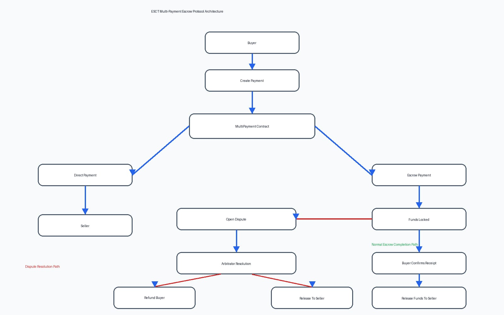
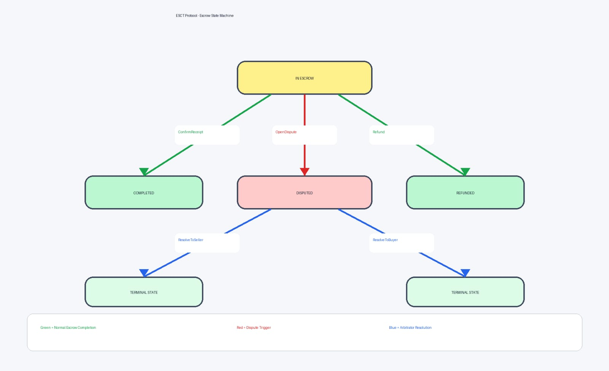
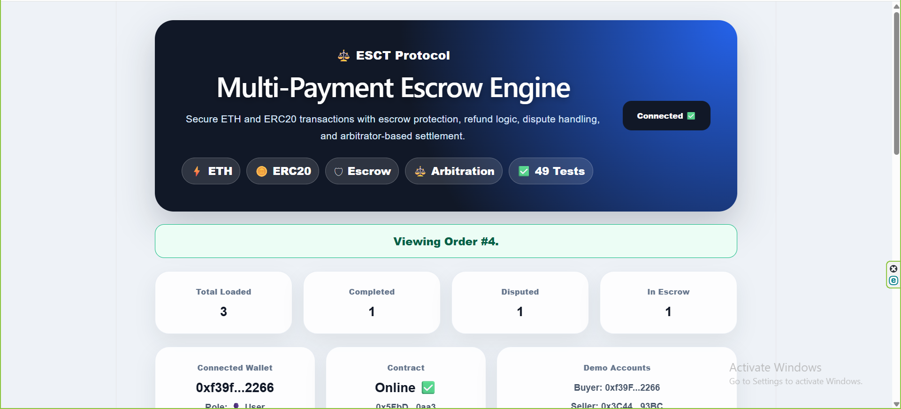
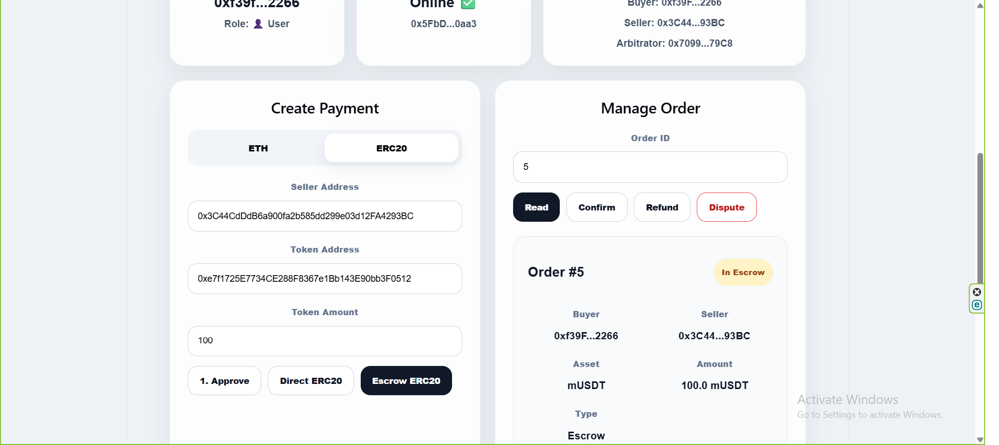
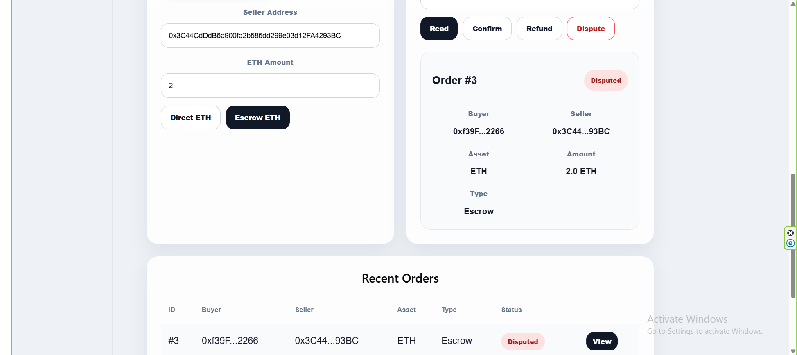
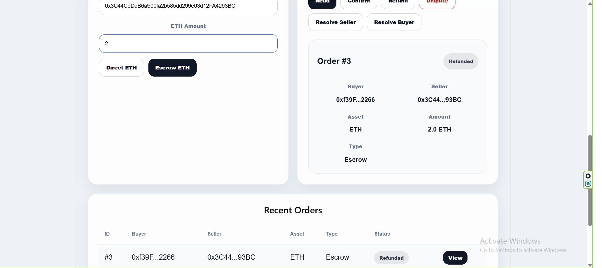

# ESCT Protocol — Multi-Payment Escrow Engine

A decentralized escrow and arbitration protocol built with Solidity, Hardhat, React, Ethers.js, and MetaMask.

ESCT enables secure ETH and ERC20 transactions through direct payments, escrow protection, dispute handling, and arbitrator-based settlement.

---

## Overview

Traditional digital payments require users to trust counterparties before receiving goods or services.

ESCT introduces an escrow-based payment model where funds remain protected until delivery is confirmed or a dispute is resolved.

The protocol supports:

- Direct Payments
- Escrow Payments
- ERC20 Payments
- Refund Handling
- Dispute Resolution
- Arbitration-Based Settlement

---

## Key Features

## ETH Payments:

- ETH Direct Payments
- ETH Escrow Payments
- Buyer Confirmation Flow
- Seller Refund Flow

## ERC20 Payments:

- ERC20 Direct Payments
- ERC20 Escrow Payments
- ERC20 Approval Flow
- Token Settlement

## Dispute Resolution:

- Buyer Opens Dispute
- Seller Opens Dispute
- Arbitrator Resolves Dispute
- Resolution To Buyer
- Resolution To Seller

## Frontend:

- React Dashboard
- MetaMask Integration
- Order Management
- Real-Time Order Tracking

---

## Architecture

The protocol is built around a single escrow engine responsible for:

- Payment Creation
- Escrow Custody
- State Management
- Dispute Handling
- Arbitration Settlement
  
  

Detailed architecture documentation:

- "Architecture Documentation" (docs/ARCHITECTURE.md)

---

## State Machine

Escrow orders follow a controlled state machine that prevents invalid transitions and ensures predictable settlement behavior.



Detailed state machine documentation:

- "State Machine Documentation" (docs/STATE_MACHINE.md)

---

## Screenshots

## Dashboard



---

## ERC20 Escrow



---

## Dispute Opened



---

## Arbitration Resolution


---

## Security

Security considerations include:

- Role-Based Access Control
- State Transition Validation
- Escrow Protection
- Input Validation
- ERC20 Allowance Verification
- Dispute Resolution Controls

Full documentation:

- "Security Documentation" (docs/SECURITY.md)

---

## Testing

Current Test Status:
```text
49 Passing Tests
0 Failing Tests
```
Coverage includes:

- ETH Direct Payments
- ETH Escrow Payments
- ERC20 Direct Payments
- ERC20 Escrow Payments
- Refund Logic
- Dispute Logic
- Arbitration Logic
- Access Control
- State Transition Validation

Detailed documentation:

- "Testing Documentation" (docs/TESTING.md)

Run tests:
```bash
npx hardhat test
```
---

## Project Structure


Multi-Payment-Dapp

│

├── contracts/

├── frontend/

├── test/

│

├── assets/

│   ├── screenshots/

│   └── diagrams/

│

├── docs/

│   ├── ARCHITECTURE.md

│   ├── STATE_MACHINE.md

│   ├── SECURITY.md

│   ├── TESTING.md

│   └── ROADMAP.md

│

└── README.md

---

## Quick Start

## Install dependencies:

```bash
npm install
```
## Run local node:

```bash
npx hardhat node
```

## Deploy contract:

```bash
npx hardhat run scripts/deploy.js --network localhost
```

## Run frontend:
```bash
cd frontend
npm install
npm run dev
```

## Run tests:
```bash
npx hardhat test
```
---

## Roadmap

## Current Version:

- ETH Direct Payments
- ETH Escrow Payments
- ERC20 Direct Payments
- ERC20 Escrow Payments
- Dispute Resolution
- Arbitration System
- React Frontend

## Planned Upgrades:

- Telegram Integration
- Milestone-Based Escrow
- Foundry Fuzz Testing
- Foundry Invariant Testing
- Security Review
- Gas Optimization

## Detailed roadmap:

- "Roadmap" (docs/ROADMAP.md)

---

## Demo

Demo video:
https://www.linkedin.com/feed/update/urn:li:activity:7467707305653084160/


---

## Tech Stack

- Solidity
- Hardhat
- Ethers.js
- React
- Vite
- MetaMask
- Mocha
- Chai

---

## License

MIT License
